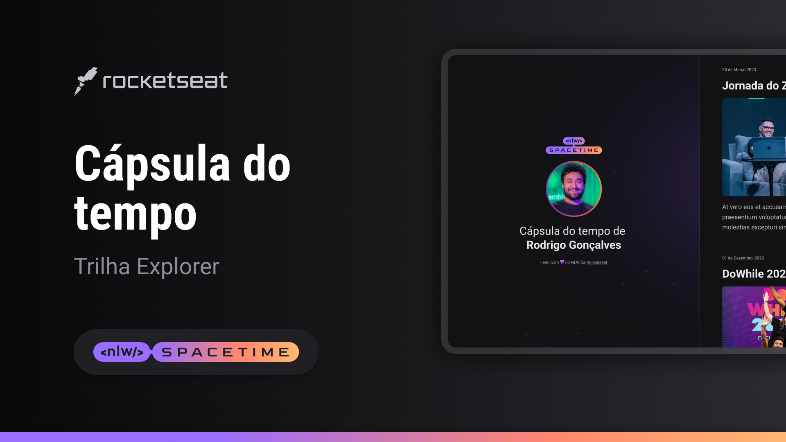

  

  

## 💻 projeto
Esse é um projeto web responsivo de  uma cápsula do tempo para exibir memórias em uma linha do tempo.

## 🚀 tecnologias
Esse projeto foi desenvolvido durante o NLW da Rocketseat com as seguintes tecnologias:

- HTML
- CSS
- Git e Github

## 🏷️ layout
voçê pode visualizar o layout do projeto através
[desse link](https://www.figma.com/file/Zf5cfql1enQT9Hcwm7FeUl/C%C3%A1psula-do-tempo-%E2%80%A2-Trilha-Explorer-(Community)-(Copy)?type=design&node-id=306%3A3&t=hf09a97t7fD2nKnm-1).
É necessário ter uma conta no [figma](https://www.figma.com)
